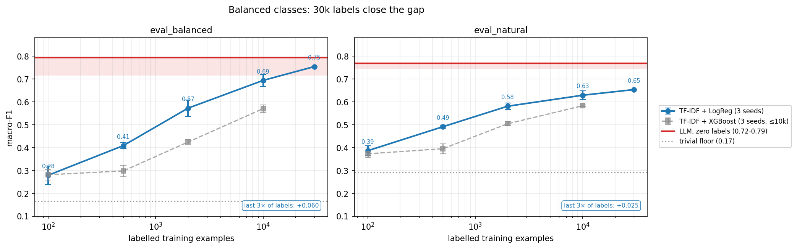

# LLM vs classical ML for text classification

A comparison of a TF-IDF baseline with zero-shot and few-shot LLMs on three-class
sentiment classification (negative / neutral / positive), using Amazon Fine Food Reviews.

Measured: macro-F1, cost per 1,000 reviews, latency, and confidence.

**Summary.** On a test set with equal classes, a TF-IDF baseline trained on 30,000 labels
showed no significant difference from the zero-shot and few-shot LLMs tested. On a test
set with the real-world class mix, the LLMs scored 0.09–0.12 macro-F1 higher, mainly on
the neutral and negative classes. The baseline took under 1 ms per review in batch
prediction; the LLMs had a median latency of 0.14–1.1 s per call. These results come
from one dataset and single LLM runs.

---

## Data

- Source: Amazon Fine Food Reviews (Kaggle, SNAP).
- Labels from star ratings: 1–2 negative, 3 neutral, 4–5 positive.
- Only the review text is used, not the summary line.
- Cleaning: HTML removed, 36,008 duplicate reviews removed, very short/long reviews
  filtered, 2 rows with impossible helpfulness values removed.

| split | rows | class mix (neg / neu / pos) | used for |
|---|---|---|---|
| `train_pool` | 30,000 | 14% / 8% / 78% | training the baseline, learning curve, picking few-shot examples |
| `dev` | 200 | 14% / 8% / 78% | writing the prompt |
| `eval_balanced` | 300 | 100 / 100 / 100 | final test, equal classes, *can the model separate the classes?* |
| `eval_natural` | 1,000 | 145 / 78 / 777 | final test, real-world class mix, *what happens in production?* |

The two test sets were not used until the prompt was final.

**Metric.** Macro-F1, because the data is 78% positive. A model that always says
"positive" gets 0.777 accuracy but only 0.292 macro-F1 on `eval_natural`.

---

## Methods

- **Baseline:** TF-IDF (1–2 word n-grams, `min_df=3`, `max_features=50,000`, sublinear
  term frequency, no stop-word removal) + Logistic Regression (`C=1.0`). XGBoost
  (400 trees, depth 6, learning rate 0.1) was also tried. Both use class weighting.
  Results are the average of 3 random seeds. XGBoost was run up to 10,000 labels only:
  each fit took about five minutes at that size, and it trailed LogReg at every size from
  500 labels on.
- **Zero-shot LLM:** one prompt, no examples, JSON output.
- **Few-shot LLM:** the same prompt plus 4 hand-picked example reviews from `train_pool`
  (2 neutral, 1 negative, 1 positive).
- **Models:** gpt-oss-20b and gpt-oss-120b (via Groq), claude-haiku-4.5 (Anthropic).
  Each LLM configuration was run once, at `temperature=0`. The gpt-oss models use
  `reasoning_effort="low"`; Haiku ran without extended thinking. Costs use the API's
  output token counts, which include reasoning tokens for gpt-oss.

**How the prompt was built.** The prompt was revised three times on the `dev` set
(macro-F1 0.622 → 0.729 → 0.763 with gpt-oss-120b) and then fixed before the test sets
were used. The few-shot prompt adds the four examples to the same prompt, so the examples
are the only difference between zero-shot and few-shot. Why these four were chosen is in
[`fewshot_candidates.md`](results/analysis/fewshot_candidates.md).

**Output checks.** Every LLM answer was checked against a fixed JSON format. 6,796 of
6,800 answers passed. The 4 failures came from one gpt-oss-120b run, which wrote a
confidence value as text ("0. nine"); they are counted as wrong answers.

---

## Results

### `eval_balanced` (300 reviews, equal classes)

| method | macro-F1 | $ / 1k reviews | median latency |
|---|---|---|---|
| always "positive" | 0.167 | — | — |
| TF-IDF + XGBoost, 10k labels | 0.571 ± 0.016 | ~$0 | <1 ms |
| TF-IDF + LogReg, 10k labels | 0.694 ± 0.027 | ~$0 | <1 ms |
| TF-IDF + LogReg, 30k labels | 0.754 | ~$0 | <1 ms |
| zero-shot gpt-oss-20b | 0.745 | $0.05 | 0.15 s |
| zero-shot gpt-oss-120b | 0.742 | $0.12 | 0.28 s |
| zero-shot claude-haiku-4.5 | 0.756 | $0.72 | 1.10 s |
| few-shot gpt-oss-20b | 0.793 | $0.09 | 0.16 s |
| few-shot gpt-oss-120b | 0.743 | $0.19 | 0.25 s |
| few-shot claude-haiku-4.5 | 0.759 | $1.19 | 1.09 s |

### `eval_natural` (1,000 reviews, real-world mix)

| method | macro-F1 | $ / 1k reviews | median latency |
|---|---|---|---|
| always "positive" | 0.292 | — | — |
| TF-IDF + XGBoost, 10k labels | 0.583 ± 0.004 | ~$0 | <1 ms |
| TF-IDF + LogReg, 10k labels | 0.629 ± 0.019 | ~$0 | <1 ms |
| TF-IDF + LogReg, 30k labels | 0.654 | ~$0 | <1 ms |
| zero-shot gpt-oss-20b | 0.750 | $0.05 | 0.15 s |
| zero-shot gpt-oss-120b | 0.761 | $0.12 | 0.25 s |
| zero-shot claude-haiku-4.5 | 0.769 | $0.71 | 1.08 s |
| few-shot gpt-oss-20b | 0.747 | $0.09 | 0.14 s |
| few-shot gpt-oss-120b | 0.762 | $0.18 | 0.22 s |

Costs are list prices (Sep 2026) from token counts, without tier or batch
discounts. The 30k-label row has no ± because it uses the whole training pool, so all
three seeds see the same data. Few-shot Haiku was not run on `eval_natural`: it is the
most expensive configuration and did not improve on zero-shot in the balanced set. The
differences between the LLMs are small and come from single runs, so they should not be
read as a ranking.

### Is the difference real?

A paired bootstrap (2,000 resamples) compared each LLM with the 30k-label baseline:

- **`eval_balanced`:** no significant difference for any LLM. All six 95% intervals include zero.
- **`eval_natural`:** every LLM is ahead, by +0.09 to +0.12 macro-F1. All five intervals
  are above zero.

A McNemar test on accuracy gave the same answer in all 11 comparisons. These intervals
cover sampling of the test set only; LLM run-to-run variation was not measured.

---


## Learning curve

How the baseline (TF-IDF + LogReg) improves as it gets more labelled data. Values are the
mean macro-F1 over 3 seeds; the 30k point uses the whole pool.



| labels | eval_balanced | eval_natural |
|---|---|---|
| 100 | 0.279 | 0.387 |
| 500 | 0.409 | 0.492 |
| 2,000 | 0.573 | 0.581 |
| 10,000 | 0.694 | 0.629 |
| 30,000 | 0.754 | 0.654 |
| LLMs (0–4 examples) | 0.742 – 0.793 | 0.747 – 0.769 |

On the balanced set, the baseline reaches the LLM range at 30,000 labels. On the natural
set it does not, and the gain from 10k to 30k labels is small (+0.025).

---

## What I observed

1. **With equal classes and 30,000 labels, no significant difference was found** between
   TF-IDF and the LLMs. With the real-world class mix, the LLMs were significantly better (paired bootstrap).
2. **The largest part of the gap is in the neutral class.** For the 30k-label baseline on
   `eval_natural`, neutral F1 is 0.325 against 0.456–0.500 for the LLMs. Negative is also
   lower (0.72 vs 0.82–0.86); positive is close (0.91 vs 0.96–0.97). Removing class
   weighting entirely made the baseline worse on every set, including `eval_natural`
   (0.654 → 0.576). Partial weighting or an adjusted decision threshold was not tried.

3. **The baseline over-predicts neutral.** On `eval_natural`, the baseline's neutral
   recall is somewhat lower than the LLMs' (0.40 vs 0.44–0.50), but its precision is much
   lower — it labels 113 reviews neutral, 60 of which are positive:

   | model | neutral precision | neutral recall | reviews labelled neutral |
   |---|---|---|---|
   | TF-IDF + LogReg, 30k | 0.27 | 0.40 | 113 |
   | zero-shot gpt-oss-20b | 0.44 | 0.50 | 88 |
   | zero-shot gpt-oss-120b | 0.52 | 0.44 | 65 |
   | zero-shot claude-haiku-4.5 | 0.49 | 0.47 | 76 |

   Neutral reviews are also hard to separate by word counts: their most distinctive terms
   are mild ones such as "okay", "average", "kinda" and "expecting"
   ([EDA](notebooks/01_eda.ipynb)).

4. **The two methods make different mistakes.** The Jaccard overlap of their error sets is
   0.28–0.35. Picking the right one for each review — an upper bound, not a real system —
   would add +0.10 to +0.14 macro-F1 on `eval_balanced` and +0.08 to +0.09 on
   `eval_natural`. Measured in accuracy, the natural-set gain looks much smaller (about
   +0.03), because the majority class already keeps accuracy high.

5. **The baseline is much faster.** Under 1 ms per review against 0.14–1.1 s for the LLMs
   (baseline: batch prediction time per review; LLMs: one call at a time).

---

## Confidence scores

- Each LLM answer includes a confidence value that the model writes itself in its JSON
  answer; it is not a token probability. Higher confidence went with more correct answers
  (AUROC 0.86–0.91 on `eval_natural`, 0.65–0.85 on `eval_balanced`), but the values are
  not well calibrated in absolute terms (ECE 0.05–0.08 on `eval_natural`, 0.07–0.15 on
  `eval_balanced`).

- *Exploratory — the threshold was chosen by looking at the test results.* For zero-shot
  gpt-oss-20b on `eval_natural` at threshold 0.80, 94% of reviews are handled
  automatically and 58 of 1,000 go to review. On the automatically handled reviews,
  macro-F1 goes from 0.750 to 0.770 and macro-precision from 0.73 to 0.78.

- At higher thresholds the same model almost stops predicting neutral (from 88 neutral
  predictions to 1–2), so precision looks better only because the hard class disappears.

- Few-shot examples made the confidence values less useful: on `eval_balanced`, few-shot
  gpt-oss-20b had the highest single-run F1 (0.793) but the lowest AUROC (0.65, against
  0.70 for zero-shot).

- Confidence ranges differ by model — Haiku never went below 0.72, while gpt-oss-20b went
  down to 0.40 — so a threshold chosen for one model does not carry over to another.

---
## Limitations

- Each LLM was run only once. Repeat runs could shift results by a few points.
- The dataset is public and old; the LLMs may have seen it during training.
- Labels come from star ratings, which do not always match the text.
- The prompt was tuned on 200 `dev` reviews (16 neutral) with gpt-oss-120b only; the
  other models used it untuned.
- The four few-shot examples were chosen once; other sets of examples were not tried.
- The baseline's settings were chosen by reasoning, not by a hyperparameter search.
- Exact duplicates were removed before splitting; near-duplicates were not checked.
- Only TF-IDF was tested as the classical model; embeddings or a fine-tuned small model
  were not tried.
- Latency includes retry waits, which were not logged separately, and was measured one
  request at a time. The median is less affected than the tail.

---
## Not tested

- **A new class.** "Sarcastic" could be added to the LLM prompt and checked for whether it
  shifts the other three classes. The baseline would need new labels and retraining, and
  the dataset has no sarcasm labels, so this needs a small hand-labelled set.
- **Labelling cost.** The labels here came free with the star ratings; the cost of
  producing them could be estimated for teams that do not have them.
- **Development time** for each approach was not recorded.
- **A real router** that sends each review to the baseline or the LLM based on confidence,
  to see how much of the upper-bound gain is reachable.
- **Baseline calibration.** Partial class weighting, a prior correction or a decision
  threshold tuned on `dev`.

---
## Project structure

```
├── .devcontainer/       # Codespaces setup: Python 3.11, dependencies, Jupyter kernel
├── src/
│   ├── data.py          # download, clean, split
│   ├── baseline.py      # TF-IDF baselines and learning curve
│   ├── llm.py           # Groq / Anthropic clients
│   ├── llm_classify.py  # LLM calls, JSON parsing, timing
│   ├── prompts.py       # zero-shot and few-shot prompts
│   ├── schema.py        # output schema
│   ├── tracker.py       # cost and run logging
│   └── config.py        # paths, sizes, prices
├── scripts/             # run_llm, analyses, plot, smoke test
├── notebooks/           # EDA and few-shot example selection
├── data/processed/      # splits (not committed)
├── results/
│   ├── runs.jsonl       # one line per run
│   ├── predictions/     # per-review predictions
│   ├── analysis/        # learning curve, overlap, confidence tables
│   └── figures/
└── requirements.txt
```


---

## How to run

**Requirements:** Set these environment variables first: `KAGGLE_USERNAME`, `KAGGLE_KEY`,
`GROQ_API_KEY` and `ANTHROPIC_API_KEY`. Then install dependencies with
`pip install -r requirements.txt`.

- `scripts/smoke_test.py` checks the setup and API keys before a long run.
- `scripts/tune_prompt.py` was used to write the prompt on the `dev` set only.
- Every run is logged as one line in `results/runs.jsonl`.

**Models and dates.** Groq `openai/gpt-oss-20b`, `openai/gpt-oss-120b` (Developer tier);
Anthropic `claude-haiku-4-5-20251001`. All LLM runs September 2026.

Run the steps in this order — later steps read the outputs of earlier ones:

```bash
python -m src.data                      # download, clean, split (Kaggle credentials)
python -m src.baseline                  # trivial floor, baselines, learning curve
python scripts/run_llm.py <model> [--balanced] [--natural] [--fewshot]
python scripts/error_overlap.py         # offline: bootstrap, McNemar, oracle
python scripts/confidence_analysis.py   # offline: confidence thresholds
python scripts/plot_learning_curve.py   # offline: figure
```

1. `src.data` — downloads, cleans and splits the data → `data/processed/`
2. `src.baseline` — trains the baselines (3 seeds) → `runs.jsonl`, `analysis/learning_curve.csv`
3. `run_llm.py` — runs one model; with no eval flag it uses both test sets. Repeat per model,
   with and without `--fewshot`
4. `error_overlap.py`, `confidence_analysis.py` — offline analyses → `analysis/`
5. `plot_learning_curve.py` — the figure; needs steps 2 and 3